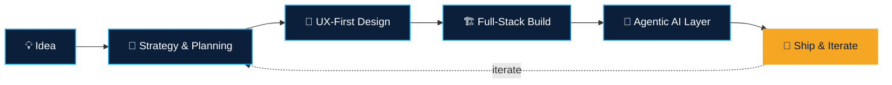

<!--
  🔧 SETUP CHECKLIST — a few steps left, then delete this comment block:
  1. Create a PUBLIC repo named EXACTLY "build-with-fun" (github.com/new → repo name "build-with-fun").
     That exact username match is what makes GitHub display this as your profile README.
  2. Upload this file as README.md at the root of that repo.
  3. Double-check the name "Ammar Ahmer" in the banner and typing animation below —
     edit it if that's not how you want to present yourself.
  4. Got a LinkedIn, X, or portfolio link? Uncomment and fill in the badges near the top.
  5. Go to your profile → "Customize your pins" to feature up to 6 real repos,
     then mirror them in the Featured Work section using the card template provided.
  6. Optional: add the contribution-snake GitHub Action — instructions are in the
     collapsible section under GitHub Stats.
-->

<div align="center">


[](https://git.io/typing-svg)

<a href="mailto:ammar.developer@proton.me"></a>
<a href="https://instagram.com/ammar.dev.404"></a>
<a href="https://github.com/build-with-fun"></a>

<!--
  Add real links when you have them, then delete the comment markers around these three:
  <a href="https://linkedin.com/in/your-handle"></a>
  <a href="https://x.com/your-handle"></a>
  <a href="https://your-portfolio.dev"></a>
-->

</div>

<br/>

## 🧑‍💻 About Me

I design and ship full-stack products end to end — from the first whiteboard sketch to a deployed, production system. Day to day that means the **MERN stack** and **Next.js 16** (Turbopack, Cache Components, the works), and increasingly, **agentic AI systems** built with LangChain, LangGraph, CrewAI, the OpenAI Agents SDK, and Deep Agents. I also build mobile apps, and I spend real time on the part a lot of engineers skip — turning a vague idea into a scoped plan and a clean architecture *before* the first line of code.

- 🏗️ **Currently building:** production-grade agentic workflows with LangGraph and the OpenAI Agents SDK
- 🧠 **Currently exploring:** hierarchical multi-agent patterns with Deep Agents and CrewAI Flows
- 🎯 **What I'm good at:** turning an ambiguous idea into a scoped plan, a clean system architecture, and a shipped product
- 💬 **Ask me about:** Next.js 16, agent harnesses (planning, sub-agents, memory), or MERN system design
- ⚡ **Fun fact:** I usually sketch the architecture on paper before opening the editor

<br/>

## 🧭 How I Work

Every project starts the same way — as a plan, not a prompt:



<br/>

## 🧰 Tech Stack

**Languages**


**Frontend**


**Backend**


**Mobile**


**Databases**


**🤖 Agentic AI & LLM Orchestration**


**Tools & Platforms**


<br/>

---

## 📊 GitHub Stats

> 💡 These widgets run on free community-hosted servers — if one looks blank, refresh after a few seconds; they occasionally get rate-limited.

<p align="center">
  
  
</p>
<p align="center">
  
</p>

<details>
<summary>🏆 More widgets — trophies & an animated contribution snake</summary>
<br/>

<p align="center">
  
</p>

Want a snake that "eats" your contribution graph? Add this as `.github/workflows/snake.yml` in your profile repo (confirmed working with `Platane/snk@v3` as of this writing — check [Platane/snk](https://github.com/Platane/snk) if you want the newest point release):

```yaml
name: Generate Snake
on:
  schedule:
    - cron: "0 0 * * *"
  workflow_dispatch: {}
  push:
    branches: [ main ]
jobs:
  generate:
    permissions:
      contents: write
    runs-on: ubuntu-latest
    steps:
      - uses: Platane/snk@v3
        with:
          github_user_name: build-with-fun
          outputs: |
            dist/snake.svg
            dist/snake-dark.svg?palette=github-dark
      - uses: crazy-max/ghaction-github-pages@v4
        with:
          target_branch: output
          build_dir: dist
        env:
          GITHUB_TOKEN: ${{ secrets.GITHUB_TOKEN }}
```

Then embed it above with:

```md
<picture>
  <source media="(prefers-color-scheme: dark)" srcset="https://raw.githubusercontent.com/build-with-fun/build-with-fun/output/snake-dark.svg" />
  
</picture>
```

</details>

<br/>

## 📌 Featured Work

GitHub's native **pinned repositories** are the cleanest way to feature projects — go to your profile → **Customize your pins** and choose up to six. Mirror them here as cards once they're pinned:

```md
[](https://github.com/build-with-fun/your-repo-name)
```

Duplicate that line per project, swapping in the real repo name each time — one card per shipped project.

<br/>

---

<p align="center">
  
</p>

<p align="center"><em>Thanks for stopping by — if you're building something ambitious with agentic AI or full-stack products, let's talk.</em></p>


