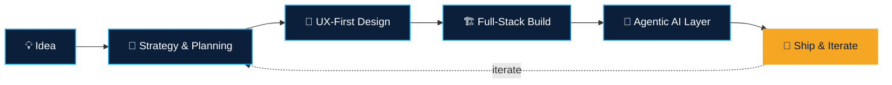

<!--
  🔧 SETUP CHECKLIST — a few steps left, then delete this comment block:
  1. Create a PUBLIC repo named EXACTLY "build-with-fun" (github.com/new → repo name "build-with-fun").
     That exact username match is what makes GitHub display this as your profile README.
  2. Upload this file as README.md at the root of that repo.
  3. Double-check the name "Ammar Ahmer" in the banner and typing animation below —
     edit it if that's not how you want to present yourself.
  4. Got a LinkedIn, X, or portfolio link? Uncomment and fill in the badges near the top.
-->

# Hello, I Am Zero.

### 🚀 Full-Stack Developer • Agentic AI Engineer • Mobile App Developer

---

 

## 🧑‍💻 About Me

I design and ship full-stack products end to end — from the first whiteboard sketch to a deployed, production system. Day to day that means the **MERN stack** and **Next.js 16** (Turbopack, Cache Components, the works), and increasingly, **agentic AI systems** built with LangChain, LangGraph, CrewAI, the OpenAI Agents SDK, and Deep Agents. I also build mobile apps, and I spend real time on the part a lot of engineers skip — turning a vague idea into a scoped plan and a clean architecture *before* the first line of code.

- 🏗️ **Currently building:** production-grade agentic workflows with LangGraph and the OpenAI Agents SDK
- 🧠 **Currently exploring:** hierarchical multi-agent patterns with Deep Agents and CrewAI Flows
- 🎯 **What I'm good at:** turning an ambiguous idea into a scoped plan, a clean system architecture, and a shipped product
- 💬 **Ask me about:** Next.js 16, agent harnesses (planning, sub-agents, memory), or MERN system design
- ⚡ **Fun fact:** I usually sketch the architecture on paper before opening the editor

 

## 🧭 How I Work

Every project starts the same way — as a plan, not a prompt:

 

## 🧰 Tech Stack

**Languages**

**Frontend**

**Backend**

**Mobile**

**Databases**

**🤖 Agentic AI & LLM Orchestration**

**Tools & Platforms**

 

---

   working expertly on different it fields

<em>Thanks for stopping by — if you're building something ambitious with agentic AI or full-stack products, let's talk.</em>

